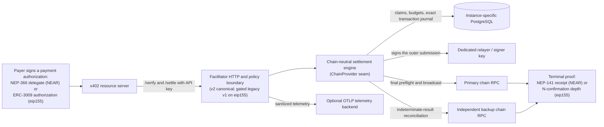
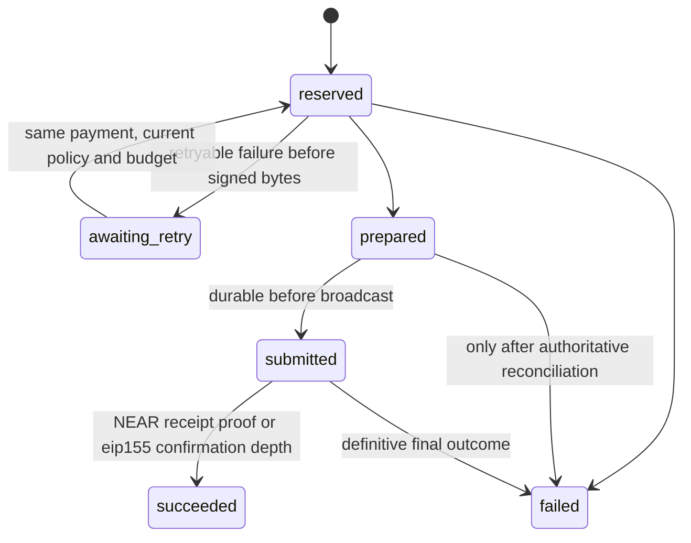

# Architecture

## System context

The resource server, not the public payer, is the API-key client. It remains
responsible for binding a payment to one protected operation. The facilitator
prevents duplicate chain settlement and can deduplicate the optional
`payment-identifier`; it cannot stop a resource server from serving multiple
responses for one payment unless that server also deduplicates.

Every instance is one process pinned to one network: separate Unix users,
relayer/signer keys, PostgreSQL databases, configuration files, ports, and
hostnames. The public reference deployment described in the dated evidence
uses one physical host and therefore does not provide host-level high
availability; that topology is not a requirement of the software.

## The chain seam

The durable engine (`service.rs`: claim, prepare, broadcast, reconcile,
terminalize) speaks neutral value types and dispatches through the
`ChainProvider` enum in `crates/x402-near-facilitator/src/chain.rs`. Enum
dispatch was chosen over trait objects deliberately: the chain set is closed
and providers keep rich typed results (see
[evm-v2-design.md](evm-v2-design.md) for the full rationale and design
history).

A new chain is an audited in-tree addition, not a runtime plugin. The provider
crate and enum arm keep chain primitives out of the engine, but the integration
also needs explicit configuration, canonical payload parsing, a durable store
projection and chain-conditional schema constraints, recovery/finality logic,
fixtures, readiness, operations, and public documentation. The complete
contract is in [adding-a-chain.md](adding-a-chain.md). Provider-specific
branches should live behind the enum/store boundary; any new engine branch
must state the invariant that prevents that encapsulation.

Wire dialects are handled entirely at the HTTP boundary: `protocol.rs`
parses canonical x402 v2 with deny-unknown-fields at every level, and
`v1_compat.rs` (active only when the instance sets `accept_v1`; eip155 only)
strictly translates a legacy v1 request into canonical v2 before that parser
runs, then formats the protocol response back into the v1 dialect (legacy
network aliases). Everything past the parse boundary — including the journal
fingerprint — sees one canonical shape, so the same payment retried in either
dialect deduplicates to one settlement.

## Components

### `x402-chain-near`

The reusable NEAR mechanism owns:

- strict base64 and Borsh decoding with no trailing bytes;
- classic NEP-366 signature verification through NEAR's domain-separated
  implementation;
- exact delegate-action structure and NEP-141 argument validation;
- block-pinned final state queries for account, access key, code, balance, and
  recipient storage;
- outer Transaction V0 construction and signing;
- final transaction lookup and inner receipt-graph validation.

It has no HTTP authentication, tenant policy, PostgreSQL schema, deployment,
or telemetry dependency.

### `x402-chain-eip155-provider`

The EVM provider owns:

- payment verification reused wholesale from the pinned upstream
  `x402-chain-eip155` implementation (ERC-3009/EIP-712, smart-wallet
  signature support, balance and authorization-state preflight);
- an offline EIP-712 payment hash plus the scoped ERC-3009 authorization nonce
  as distinct request-identity and chain-enforced single-use values;
- durable submission of the signed `transferWithAuthorization` with sponsored
  gas, exact Base L1 fee accounting, and independent primary/backup reads for
  signer state and receipt identity;
- reorg-aware interpretation: terminal success only at the configured
  `required_confirmations`, with mined-then-missing transactions demoted back
  to nonterminal for re-evaluation.

### Service boundary

The service owns:

- canonical x402 `/supported`, `/verify`, and `/settle` response shapes, plus
  the gated legacy-v1 request translation and response formatting;
- content-type and 64 KiB body enforcement;
- API-key authentication and exact policy lookup;
- per-key request limits and sponsorship budgets;
- durable idempotency and settlement state;
- active-instance leadership and startup reconciliation;
- secret redaction, request IDs, and OTLP export;
- health and sanitized readiness (chain-appropriate checks: RPC finality and
  relayer state on NEAR; expected `eth_chainId` and the signer gas hard stop
  on eip155).

Expected payment rejection remains an HTTP 200 protocol result. Malformed
transport, authentication, policy quota, identifier conflict, and unavailable
infrastructure are HTTP errors.

### Administration boundary

`x402-near-admin` uses explicit database or configuration inputs to apply
migrations, manage API clients and exact payee policies, rotate or revoke
credentials, set budgets, and start an operator-directed reconciliation.
It is not exposed over HTTP. Migration credentials are never supplied to the
service process.

The `x402-near-facilitator` package and binary names are historical
compatibility identifiers from the original NEAR-only launch. They now contain
the shared NEAR/Base service and are not intended to describe a NEAR-only
engine.

## Verify flow

1. Nginx accepts only JSON bodies no larger than 64 KiB and forwards a request
   ID without logging authentication headers or bodies.
2. The service authenticates `X-API-Key`, Bearer, or identical values in both
   forms, then applies the key's verify rate limit. Non-identical dual
   credentials are rejected.
3. The body parses as canonical v2 (a legacy v1 request is first strictly
   translated when `accept_v1` is set). Version, scheme `exact`, the pinned
   network, configured Circle asset, minimum amount, and the client's exact
   payee policy are validated.
4. The chain mechanism verifies the signed authorization before trusting the
   payer identity — NEP-366 signature on NEAR, EIP-712/ERC-3009 recovery on
   eip155.
5. Chain preflight runs against final state: block-pinned account, access-key,
   balance, and storage checks on NEAR; balance and authorization-state
   checks on eip155.
6. A valid or invalid x402 response is returned (in the request's dialect).
   No relayer nonce is consumed and no transaction is broadcast.

Verification is a current-state preflight, not a reservation. Settlement
repeats it because payer state can change.

## Settle flow

Chain-neutral spine (both chains):

1. Authenticate, enforce policy, derive the chain-enforced payment anchor
   (domain-prefixed delegate hash / scoped ERC-3009 authorization nonce), validate the optional
   payment identifier, and begin one PostgreSQL transaction.
2. Claim the payment, persist the normalized request and policy snapshot, and
   reserve the conservative sponsorship amount atomically.
3. Acquire active-instance leadership, reverify against live chain state, and
   construct exactly one outer submission.
4. Persist the signer identity, account nonce, exact signed bytes, and
   transaction hash as `prepared` before submission; durably mark `submitted`
   before broadcasting the already-stored bytes.
5. Wait for the chain's terminal proof, bind the returned transaction
   identity to the exact stored hash, and persist the exact terminal
   response; reconcile reserved sponsorship to actual cost.

Chain-specific terminal proof:

- **NEAR** — wait for `FINAL`, then walk the receipt graph
  (transaction → payer delegate receipt → exactly one configured token
  receipt) and require that token receipt to be `SuccessValue`; the relayer
  mutex spans the final nonce read through terminal outcome.
- **eip155** — wait for the stored transaction to hold
  `required_confirmations` of depth with matching block identity; a mined
  transaction that disappears before depth returns to nonterminal, and the
  terminal row records the mined block, confirmation count, and reorg-audit
  columns.

Concurrent calls for the same payment join or return the recorded result. A
different identifier cannot make the same authorization payable twice.

## Journal and recovery

The source of truth is PostgreSQL. The minimum logical records are:

| Record | Purpose |
| --- | --- |
| API client | Public identifier/prefix, HMAC digest, status, rate and sponsorship policy |
| Payee policy | Exact client, network, asset, and `pay_to` tuple |
| Settlement | Scoped chain-enforced payment anchor, identifier/fingerprint, policy snapshot, lifecycle and attempt count, exact signed submission, minimal authorization metadata (delegate identity on NEAR; ERC-3009 validity window on eip155), signer, terminal evidence, and response |
| Daily sponsorship ledger | Atomic reservation and actual sponsored cost by instance/client/day |

Submission states move forward. A deliberate pre-broadcast retry loop releases
budget and signer ownership while retaining the payment anchor:

`awaiting_retry` is dormant: it owns neither budget nor signer nonce, is not
broadcastable, and can return to `reserved` only when the same canonical
payment is presented again and current policy and budget are reacquired
atomically. Its scoped anchor remains reserved, so another identifier cannot
claim the authorization.

Nonterminal rows are never expired by retention jobs. On startup, the process
holds a session advisory lock and keeps readiness false while reconciling active
rows:

- stale `reserved` rows without an outer transaction can release their budget;
- `prepared` and `submitted` hashes are queried on primary, then backup RPC;
- a final result is terminal only when it matches the stored transaction
  identity and satisfies the chain's proof (unique inner token receipt on
  NEAR; confirmation depth on eip155) or a typed on-chain execution failure;
- pending, missing, structurally inconsistent, identity-mismatched, or
  RPC-ambiguous evidence is indeterminate: the row remains nonterminal,
  readiness stays false, and callers receive a retryable 503 rather than a
  guessed x402 result;
- on NEAR, when both RPCs report the hash unknown, relayer nonces are
  unchanged, and the delegate expiry height has passed, the settlement is a
  definitive failure and is never rebroadcast; a consumed relayer nonce with
  no known stored transaction quarantines the key and keeps readiness false;
- exact stored bytes may be rebroadcast only while the authorization remains
  valid and only after both providers' checks — never by signing a new
  transaction.

## Deployment boundary

The production boundary assumes a TLS reverse proxy in front of a loopback-only
service. Unknown hostnames and methods should be denied before Axum, request
bodies and upstream timeouts bounded, and authentication headers marked
sensitive before request tracing. Each network has a separate process, Unix
identity, configuration, credential set, database, signer, and public
hostname.

The checked-in systemd and Nginx files implement that shape without making a
particular cloud, DNS provider, or account hierarchy part of the architecture.
Immutable version directories and atomic per-instance pointers allow one
network to be promoted or rolled back independently. Database migrations are
forward-only, and the changelog for each release defines its configuration and
schema rollback boundary.

The original planned hostnames, ports, identities, and version-specific
procedures are retained in the dated historical
[reference-deployment runbook snapshot](evidence/2026-07-26-reference-deployment-runbook-snapshot.md),
not as software defaults or proof that every target went live.
