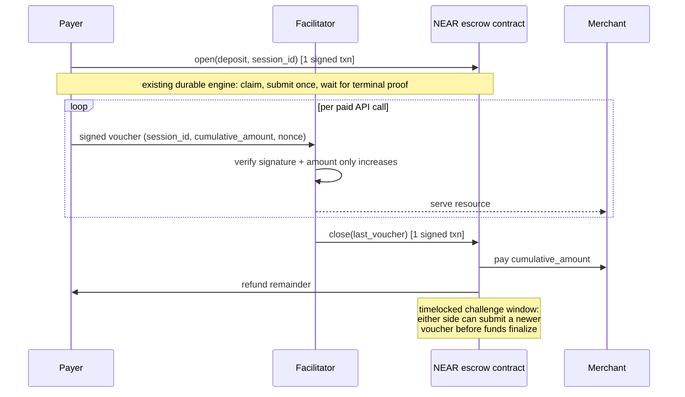

# NEAR session payments — proposal sketch (DRAFT)

> **Status: draft, RFC.** This is a proposal for discussion, not an
> implementation. Nothing here is built, configured, or advertised on any
> instance. Field names, contract shape, and the challenge-window mechanics
> are all open questions below, not settled design.

## Motivation

Today every `exact` NEAR payment is one signed delegate action settling one
payment: sign once, settle once. For an agent making many small paid calls to
the same resource server in one session (e.g. a metered API), that means one
on-chain transaction per call.

This proposal sketches a **sign-once, settle-many** session on top of the
existing NEAR provider: one on-chain open, an arbitrary number of off-chain
signed vouchers, and one on-chain close — regardless of how many calls happen
in between.

## Why this can stay in-tree

Session payments change how a batch of NEAR payments is authorized and
closed, but they do not introduce another chain, another asset policy, or
another RPC/finality model. The open and close transactions are ordinary
NEAR transactions through the same durable settlement engine already used by
`delegate` today — exactly-once claim, PostgreSQL journal, crash recovery,
and terminal-receipt confirmation are all reused unchanged.

The new surface is:

- a small escrow contract (holds the session deposit, validates the closing
  voucher, pays the merchant, refunds the remainder, and enforces a
  challenge window);
- an off-chain, per-call voucher: a lightweight signed message carrying a
  monotonically increasing cumulative amount, verified by signature only —
  no RPC call and no chain write per call.

## Sketch: session lifecycle

A session of N calls costs **2 NEAR transactions total** (open, close), not
N — the vouchers in between are pure off-chain signature checks.

## Open questions (must resolve before a chain-proposal issue)

- **Single-use anchor:** what is chain-enforced and scoped per session —
  likely the session id plus payer key, distinct from the NEP-366 delegate
  hash used by `delegate` today.
- **Dispute/challenge window:** how long, who can trigger a force-close, and
  what happens if the facilitator never closes (payer-initiated close must
  be possible without the facilitator's cooperation).
- **Voucher signature standard:** NEP-413 message signing (matching existing
  wallet support) vs. a bespoke scheme.
- **Bounded trust window:** between vouchers, worst case exposure is capped
  at the last voucher's amount — needs to be stated as an explicit
  guarantee, not an assumption.
- **Contract audit surface:** this is new custody logic (funds sit in escrow,
  not moved directly per payment), so it needs the same rigor as any other
  chain-enforced anchor per [adding-a-chain.md](adding-a-chain.md).

## Non-goals for this sketch

- Does not touch the `delegate` method or its full-access-key, one-transfer,
  one-yocto-deposit constraints.
- Does not propose EVM/Base session support (a parallel but separate design,
  since ERC-3009 has no channel semantics either).
- Does not claim any deployment, canary, or dated evidence — this is a
  design discussion only.
